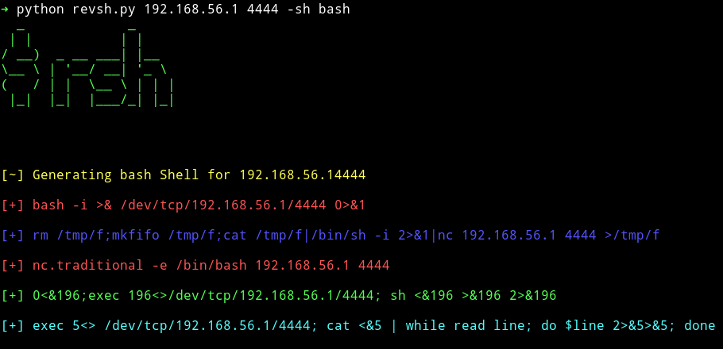
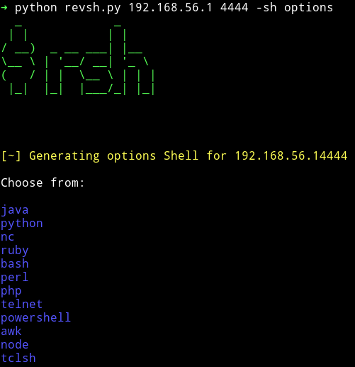
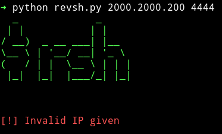
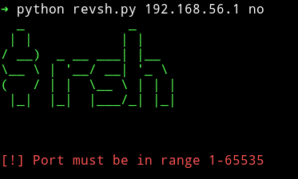

<h1 align="center">rsh</h1>

<!--- See for dropping Python 3.5 support https://devguide.python.org/#status-of-python-branches -->
[](https://www.python.org/downloads/)
[](https://www.python.org/dev/peps/pep-0008/)
[](https://github.com/mzfr/rsh/graphs/contributors)
[](https://github.com/mzfr/rsh/issues)
[](https://www.gnu.org/licenses/gpl-3.0)
[](https://github.com/mzfr/rsh/graphs/commit-activity)



<p align="center">
  <a href="#features">Introduction</a> •
  <a href="#usage">Usage</a> •
  <a href="#installation">Installation</a> •
  <a href="#gallery">Gallery</a>
</p>

rsh is a tool purely written in Python 3 to easily a generate reverse shell command for Linux as well as Windows.

### Features

This tools makes it easy for you to quickly generate reverse shell commands supported in both Linux and Windows, in the following languages:

* bash
    - Bash reverse shell
    - netcat
    - netcat OpenBSD
    - nc.traditional
* Python
    - IPv4
    - IPv6
* Ruby
* Perl
* PHP
* Powershell
* Node.JS
* TCLSH
* Awk
* Java

### Usage

```
usage: rsh [-h] [-sh SH] [-listen] lhost lport

positional arguments:
  lhost       Specify local host ip
  lport       Specify a local port

optional arguments:
  -h, --help  show this help message and exit
  -sh SH      Specify the language to generate the reverse shell
  -listen     Spawn a netcat listener for this shell.
```

Using rsh is very simple. All you need to do is provide an IP and port and the type of shell that is to be generated:

* `./rsh 192.168.56.1 4444 -sh bash`
* `./rsh 192.168.56.1 4444 -sh php`
* `./rsh 192.168.56.1 4444 -sh powershell`

You can also automatically catch the reverse shell by starting a listener when you are done. This uses netcat and listens on the port you specified for your reverse shell
* `./rsh 192.168.56.1 4444 -sh powershell -listen`

### Installation

You need to have Python 3.5 or greater installed to run rsh. Both Linux and Windows are supported.
Along with that rsh uses [pyfiglet](https://pypi.org/project/pyfiglet/) which you can install by running:

```
pip install -r requirements.txt
```

### Gallery

* __Getting bash command__


* __Options__



* __Wrong IP__ :smile:



* __Wrong PORT__ :smile:



### Contribution

* Report a bug
* Fix something and open a pull request
* Add more reverse shells

In any case feel free to open an issue

## Credits

All the shell command are taken from [pentestmonkey](http://pentestmonkey.net/)

## License

This project is licensed under the GPLv3 License - see the [LICENSE](LICENSE) file for details

## Support

If you'd like you can buy me some coffee:

<a href="https://www.buymeacoffee.com/mzfr" target="_blank"></a>
